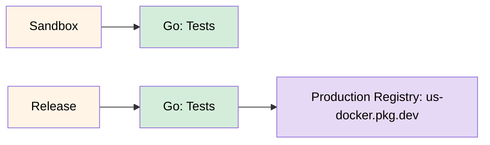

# Istio Test

An example Istio test application that shows information about the Google Kubernetes Engine (GKE) cluster.

## GitHub Actions Workflows



**Workflow Details:**

- **Sandbox**: Triggered on pull request (opened, synchronize), excluding .md files; manual dispatch — runs Go tests
- **Release**: Triggered on published GitHub release — runs Go tests, then builds and pushes the container image to `us-docker.pkg.dev/pt-corpus-tf16-prod/pt-pneuma-standard`
- **Registry**: `us-docker.pkg.dev/pt-corpus-tf16-prod/pt-pneuma-standard/istio-test`
- **Authentication**: Workload Identity Federation via `pt-pneuma-github@pt-corpus-tf16-prod.iam.gserviceaccount.com`

## Usage

```yaml
---
apiVersion: v1
kind: Namespace

metadata:
  name: istio-test

---
apiVersion: apps/v1
kind: Deployment

metadata:
  name: istio-test
  namespace: istio-test

spec:
  replicas: 1
  selector:
    matchLabels:
      app: istio-test

  template:
    metadata:
      labels:
        app: istio-test

    spec:
      containers:
        - image: ghcr.io/osinfra-io/istio-test:latest
          imagePullPolicy: Always
          name: istio-test

          ports:
            - containerPort: 8080

          resources:
            limits:
              cpu: "50m"
              memory: "128Mi"
            requests:
              cpu: "25m"
              memory: "64Mi"

---
apiVersion: v1
kind: Service

metadata:
  name: istio-test
  namespace: istio-test

  labels:
    app: istio-test

spec:
  ports:
    - name: http
      port: 8080
      targetPort: 8080

  selector:
    app: istio-test

```

After deploying, you can get the information about the GKE cluster by running the following command:

```bash
kubectl port-forward --namespace istio-test $(kubectl get pod --namespace istio-test --selector="app=istio-test" --output jsonpath='{.items[0].metadata.name}') 8080:8080
```

Curl the endpoint:

```bash
curl http://localhost:8080/istio-test
```
